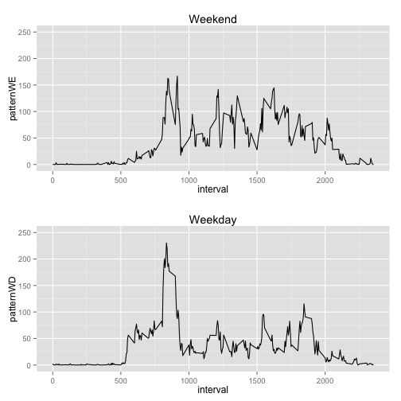

# Reproducible Research: Peer Assessment 1

This data analysis is to process `activity.csv` dataset and will answer the following questions:

1. Whati is mean total number of steps taken per day?

2. What is the average daily activity pattern?

3. Fill-in the missing values in the dataset.

4. Are there differences in activity patterns between weekdays and weekends?

## Loading and preprocessing the data

The following R codes loaded the activity dataset and display the first several observations:


```r
activityData <- read.csv(file="activity.csv")
head(activityData)
```

```
##   steps       date interval
## 1    NA 2012-10-01        0
## 2    NA 2012-10-01        5
## 3    NA 2012-10-01       10
## 4    NA 2012-10-01       15
## 5    NA 2012-10-01       20
## 6    NA 2012-10-01       25
```

## What is mean total number of steps taken per day?

First, we compute the total number of steps of each day:

```r
totalStepsEachDay <- tapply(activityData$steps, activityData$date, sum)
totalStepsEachDay
```

```
## 2012-10-01 2012-10-02 2012-10-03 2012-10-04 2012-10-05 2012-10-06 
##         NA        126      11352      12116      13294      15420 
## 2012-10-07 2012-10-08 2012-10-09 2012-10-10 2012-10-11 2012-10-12 
##      11015         NA      12811       9900      10304      17382 
## 2012-10-13 2012-10-14 2012-10-15 2012-10-16 2012-10-17 2012-10-18 
##      12426      15098      10139      15084      13452      10056 
## 2012-10-19 2012-10-20 2012-10-21 2012-10-22 2012-10-23 2012-10-24 
##      11829      10395       8821      13460       8918       8355 
## 2012-10-25 2012-10-26 2012-10-27 2012-10-28 2012-10-29 2012-10-30 
##       2492       6778      10119      11458       5018       9819 
## 2012-10-31 2012-11-01 2012-11-02 2012-11-03 2012-11-04 2012-11-05 
##      15414         NA      10600      10571         NA      10439 
## 2012-11-06 2012-11-07 2012-11-08 2012-11-09 2012-11-10 2012-11-11 
##       8334      12883       3219         NA         NA      12608 
## 2012-11-12 2012-11-13 2012-11-14 2012-11-15 2012-11-16 2012-11-17 
##      10765       7336         NA         41       5441      14339 
## 2012-11-18 2012-11-19 2012-11-20 2012-11-21 2012-11-22 2012-11-23 
##      15110       8841       4472      12787      20427      21194 
## 2012-11-24 2012-11-25 2012-11-26 2012-11-27 2012-11-28 2012-11-29 
##      14478      11834      11162      13646      10183       7047 
## 2012-11-30 
##         NA
```

And we plot the histogram of the generated data and have an overall impression of the data. A `summary` command can provide the mean and median of the data.

```r
hist(totalStepsEachDay, breaks = 10)
```

 

```r
summary(totalStepsEachDay)
```

```
##    Min. 1st Qu.  Median    Mean 3rd Qu.    Max.    NA's 
##      41    8840   10800   10800   13300   21200       8
```

## What is the average daily activity pattern?
The following command average out the daily steps at each interval:

```r
stepsPattern <- tapply(activityData$steps, activityData$interval, mean, na.rm = TRUE)
head(stepsPattern)
```

```
##       0       5      10      15      20      25 
## 1.71698 0.33962 0.13208 0.15094 0.07547 2.09434
```

To extract the interval time from the dataset row names:

```r
interval <- as.integer(rownames(stepsPattern))
```

Thus, we can plot the average daily activity pattern:

```r
plot(interval, stepsPattern, type ="l")
```

 

## Imputing missing values
We can use `summary` command to identify how many `NA` values are in the dataset.

```r
summary(activityData)
```

```
##      steps               date          interval   
##  Min.   :  0.0   2012-10-01:  288   Min.   :   0  
##  1st Qu.:  0.0   2012-10-02:  288   1st Qu.: 589  
##  Median :  0.0   2012-10-03:  288   Median :1178  
##  Mean   : 37.4   2012-10-04:  288   Mean   :1178  
##  3rd Qu.: 12.0   2012-10-05:  288   3rd Qu.:1766  
##  Max.   :806.0   2012-10-06:  288   Max.   :2355  
##  NA's   :2304    (Other)   :15840
```
There are 2304 `NA` in the dataset.  

We will fill the missing values with the average steps for that interval. And the new dataset will be stored in `activityDataNArm`.

```r
activityDataNArm <- activityData
indexNA <- which(is.na(activityDataNArm$steps))
activityDataNArm$steps[indexNA] <- stepsPattern[sapply(activityDataNArm$interval[indexNA], toString)]
```

Again, we compute the total number of steps of each day:

```r
totalStepsEachDayNArm <- tapply(activityDataNArm$steps, activityDataNArm$date, sum)
totalStepsEachDayNArm
```

```
## 2012-10-01 2012-10-02 2012-10-03 2012-10-04 2012-10-05 2012-10-06 
##      10766        126      11352      12116      13294      15420 
## 2012-10-07 2012-10-08 2012-10-09 2012-10-10 2012-10-11 2012-10-12 
##      11015      10766      12811       9900      10304      17382 
## 2012-10-13 2012-10-14 2012-10-15 2012-10-16 2012-10-17 2012-10-18 
##      12426      15098      10139      15084      13452      10056 
## 2012-10-19 2012-10-20 2012-10-21 2012-10-22 2012-10-23 2012-10-24 
##      11829      10395       8821      13460       8918       8355 
## 2012-10-25 2012-10-26 2012-10-27 2012-10-28 2012-10-29 2012-10-30 
##       2492       6778      10119      11458       5018       9819 
## 2012-10-31 2012-11-01 2012-11-02 2012-11-03 2012-11-04 2012-11-05 
##      15414      10766      10600      10571      10766      10439 
## 2012-11-06 2012-11-07 2012-11-08 2012-11-09 2012-11-10 2012-11-11 
##       8334      12883       3219      10766      10766      12608 
## 2012-11-12 2012-11-13 2012-11-14 2012-11-15 2012-11-16 2012-11-17 
##      10765       7336      10766         41       5441      14339 
## 2012-11-18 2012-11-19 2012-11-20 2012-11-21 2012-11-22 2012-11-23 
##      15110       8841       4472      12787      20427      21194 
## 2012-11-24 2012-11-25 2012-11-26 2012-11-27 2012-11-28 2012-11-29 
##      14478      11834      11162      13646      10183       7047 
## 2012-11-30 
##      10766
```

And we plot the histogram of the newly-generated data. A `summary` command can provide the mean and median of the data.

```r
hist(totalStepsEachDayNArm, breaks = 10)
```

 

```r
summary(totalStepsEachDayNArm)
```

```
##    Min. 1st Qu.  Median    Mean 3rd Qu.    Max. 
##      41    9820   10800   10800   12800   21200
```

By comparing the newly-generated data and the old data, we found that the median and mean didn't change. By using this method to fill the missing data, the frequency at the median increased.

## Are there differences in activity patterns between weekdays and weekends?
First, we should get the weekday labels for each observations and subsetting the data into two datasets: `weekdayData` and `weekendData`:


```r
# Get the weekday labels for each observation.
weekdayLabels <- weekdays(as.Date(activityDataNArm$date,format = "%Y-%m-%d"),abbreviate = TRUE)

# Get the index for the weekdays.
weekdayIndex <- which(weekdayLabels %in% c("Mon","Tue","Wed","Thu","Fri"))

# Get the index for the weekends.
weekendIndex <- which(weekdayLabels %in% c("Sat","Sun"))

# Subsetting the data
weekdayData <- activityDataNArm[weekdayIndex, ]
head(weekdayData)
```

```
##     steps       date interval
## 1 1.71698 2012-10-01        0
## 2 0.33962 2012-10-01        5
## 3 0.13208 2012-10-01       10
## 4 0.15094 2012-10-01       15
## 5 0.07547 2012-10-01       20
## 6 2.09434 2012-10-01       25
```

```r
weekendData <- activityDataNArm[weekendIndex, ]
head(weekendData)
```

```
##      steps       date interval
## 1441     0 2012-10-06        0
## 1442     0 2012-10-06        5
## 1443     0 2012-10-06       10
## 1444     0 2012-10-06       15
## 1445     0 2012-10-06       20
## 1446     0 2012-10-06       25
```

And we can use exactly same method to compute the average activity patterns for both weekdays and weekend.

```r
# Get the weekday pattern.
patternWD <- tapply(weekdayData$steps, weekdayData$interval, mean, na.rm = TRUE)
head(patternWD)
```

```
##       0       5      10      15      20      25 
## 2.25115 0.44528 0.17317 0.19790 0.09895 1.59036
```

```r
# Get the weekend pattern.
patternWE <- tapply(weekendData$steps, weekendData$interval, mean, na.rm = TRUE)
head(patternWE)
```

```
##        0        5       10       15       20       25 
## 0.214623 0.042453 0.016509 0.018868 0.009434 3.511792
```

```r
# Plot the data
library(ggplot2)
library(gridExtra)
```

```
## Loading required package: grid
```

```r
plot1 <- qplot(interval, patternWE, ylim = c(0,250), main = "Weekend", geom = "line")
plot2 <- qplot(interval, patternWD, ylim = c(0,250), main = "Weekday", geom = "line")
grid.arrange(plot1,plot2,nrow=2)
```

 


It looks like there is strong activity at early time of a day during weekday and the activities are more averaged during the weekends.
